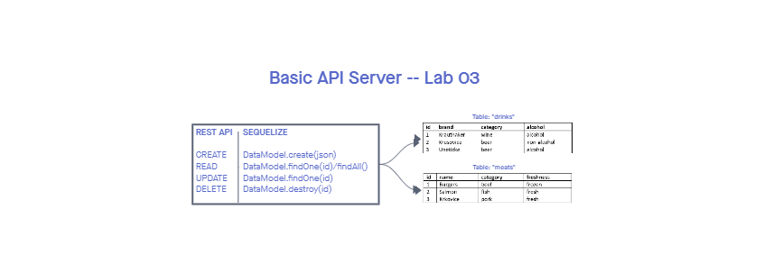

# Lab-03

## Basic API Server

### Author: Alan Chelko

    * Server testing
    * Middleware testing
    * CI/CD with Github and Heroku (incl. Postgres sync)
    * Created 2 SQL data models using the Sequelize libary and Postgres database

### Setup

    * PORT: 3001

### Deployed server

    * Heroku: [chelko-basic-api-server-prod](https://dashboard.heroku.com/apps/chelko-basic-api-server-prod/)

### Running the app

    * npm start
    * Endpoint: '/'
        * Returns 'Hello, welcome to the World of Meat and Drinks!'
    * Endpoint: '/meat'
        * Create a record with POST
        * Read a record (for all, or for single record with ID) with GET
        * Update a record (using ID) with PUT
        * Delete a record (using ID) with DELETE
    * Endpoint: '/drinks'
        * Create a record with POST
        * Read a record (for all, or for single record with ID) with GET
        * Update a record (using ID) with PUT
        * Delete a record (using ID) with DELETE
    *  Enpoint: '/*' (i.e. anything other than '/bad')
        * Returns object with 404 error

### Tests

    * npm test

### UML: Basic API Server -- Lab 03 UML

